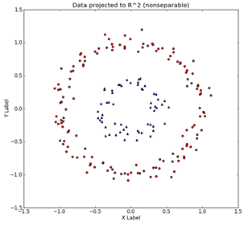

# Why Neural Networks?

So why use Neural Networks at all when we have such great models like Linear and Logistic Regression at our disposal?

Well sometimes, these models just  aren't enough to separate out our data. Take this dataset for example:



We can't just draw a straight line, or an S-shaped line though this thing to cleanly
divide the red and blue points. We need a model that can take on more non-linear shapes.
That's where Neural Networks can be very useful!

> **NOTE**: Neural Networks can still be overkill for problems like this, but this is for the sake
of an introductory workshop. There are plenty of other models in the Scikit Learn library that
can handle data like this. Try checking out [Support Vector Machines](https://scikit-learn.org/stable/modules/svm.html)
for example.

---

We were able to achieve a respectable accuracy on scikit-learn's digits dataset using logistic regression. However,
the dataset was quite small and simple - each image was only 8 pixels by 8 pixels. Many monitors today support a
resolution of at least 1920 pixels by 1080 pixels, so 8x8 is almost primitive compared to real-world data we'd
be working with.

Take, for instance, the MNIST dataset, which contains 28 x 28 pixel handwritten digits for classification. 
If we train a logistic regression model on this data, we'll see a noticeable decrease in performance. 
```python
import tensorflow as tf

# Load in the MNIST dataset from TensorFlow
mnist = tf.keras.datasets.mnist

# Split the MNIST set into training and testing sets
(X_train, Y_train), (X_test, Y_test) = mnist.load_data() # This is already split, unlike in digits
X_train, X_test = X_train / 255, X_test / 255            # Pixel values are 0-255, so let's shrink
                                                         # them to between 0 and 1

# Reshape the training and testing sets for compatibility with sklearn's LogisticRegression()
X_train = X_train.reshape(X_train.shape[0], -1)
X_test = X_test.reshape(X_test.shape[0], -1)


from sklearn.linear_model import LogisticRegression

# Initialize a LogisticRegression object
logistic_model = LogisticRegression()

# Fit the logistic regression algorithm with the training data
logistic_model.fit(X_train[:10000, :], Y_train[:10000])

print("Logistic Regression Regression accuracy:", str(logistic_model.score(X_test, Y_test) * 100) + "%")
```

While logistic regression achieved ~95% accuracy on the digits dataset, it only achieves ~90% on the MNIST dataset.
What if we need better than this? This is where neural networks come in handy. 

# Building Our First Neural Network
## Creating a Neural Network Model
```python
import tensorflow as tf

# Load in the MNIST dataset from TensorFlow
mnist = tf.keras.datasets.mnist

# Split the MNIST set into training and testing sets
(X_train, Y_train), (X_test, Y_test) = mnist.load_data()
X_train, X_test = X_train / 255, X_test / 255

# Create a neural network model
model = tf.keras.models.Sequential([
  # Vectorize the input for faster processing
  tf.keras.layers.Flatten(input_shape=(28, 28)),
  
  '''
  This line adds a dense layer to the neural network. Dense layers are fully connected layers, 
  which are the standard "layers" in a neural network.
 
  128 - units of output dimensionality. We generally try to use powers of 2 (64, 128, 256, etc) 
  here because they're most efficient on GPUs. Finding a good value here is important - 
  2048 would be overkill on the MNIST dataset, but 16 might not be enough.
 
  activation='relu' - relu stands for Rectified Linear Unit. Essentially, this activation adds 
  non-linearity to the neural network. If you try to run a linear regression model on this dataset, 
  you'll see it does very poorly. This suggests that it would be a good idea to add some 
  non-linearity to this problem.
  '''
  tf.keras.layers.Dense(128, activation='relu'),
  
  '''
  Dropout is a good layer for avoiding overfitting - training a machine learning algorithm
  on a training set too much. This causes the machine learning algorithm to notice irrelevant aspects 
  ("noise") of the training set. It essentially adds a layer of randomness to the neural network by 
  ignoring a percentage of random inputs (in this case, ignore a random 20%) on each iteration. 
  "If you're good at something while drunk, you'll be really good at it sober" - Ryan McCormick, 2019
  '''
  tf.keras.layers.Dropout(0.2),
  
  '''
  Add another dense layer, but this time with an output dimensionality of 10 units because there are
  only 10 options (there are only 10 digits).
  
  activation='softmax' turns the arbitrary outputs of the neural network into "probabilities".
  
  The final decision made by the neural network should be the output with the highest probability.
  
  Example:
      Input: Image of handwritten "2"
      Output: [0.01, 0.02, 0.9, 0.01, 0.005, 0.005, 0.02, 0.01, 0.01, 0.01]
          > Softmax gives us 10 probabilities, one for each digit 0 - 9.
      Interpretation: This image is a handwritten "2" with probability of 0.9, or 90%.
  '''
  tf.keras.layers.Dense(10, activation='softmax')
])
```

## Training Our Model

```python
# Compile the model
model.compile(optimizer='adam',
              loss='sparse_categorical_crossentropy',
              metrics=['accuracy'])

'''
Fit the model to the training set. Epochs is the number of times we fit the neural network to the training set.
Be careful of adding too many epochs, however! Overfitting can be just as bad as underfitting.
'''
model.fit(X_train, Y_train, epochs=5)

# Evaluate the accuracy of the neural network and print it out
test_loss, test_acc = model.evaluate(X_test, Y_test)

print(test_acc)
```

When we print out the testing accuracy, we can see that our simple neural network greatly outperforms
our logistic regression model (~98% vs ~90%).


